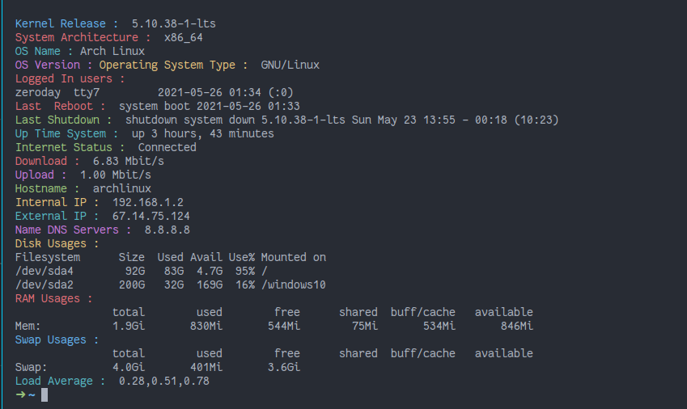
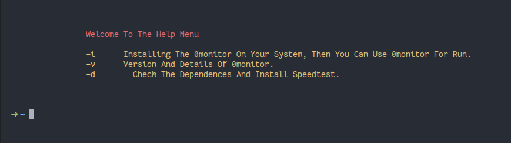

# Features
1. **Kernel Release**
2. **System Architecture**
3. **OS Version**
4. **OS Type**
5. **Information About Users**
6. **Last Reboot**
7. **Last Shutdown**
8. **Up Time System**
9. **Internet Status**
10. **Download Speed**
11. **Upload Speed**
12. **Hostname**
13. **Internal IP**
14. **External IP**
15. **DNS**
16. **Disk Usages**
17. **Ram Usages**
18. **Swap Usages**
19. **Load Average**


#  Installation
```
git clone https://github.com/The-0Day/0monitor.git
cd 0monitor
chmod +x 0monitor.sh
```

 ### Prerequisites
- `dig`
-  `wget`
- `speedtest`
# ArchLinux :
```
sudo pacman -S dnsutils
sudo pacman -S wget
```
# 

# How can i install speedtest ?

You can Install Speedtest via 0monitor, just run:
```
./0monitor -d
```
# Now You Can Run Script
```
./0monitor.sh
```


# Also you can install it on your system, run command :
```
./0monitor -i
```

# See help
```
./0monitor.sh -h
```


## License
0monitor is released under the [BSD 2-Clause](LICENSE)

